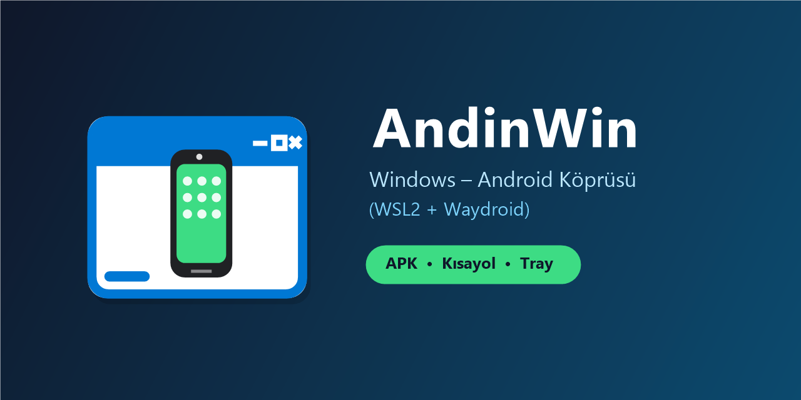

<div align="center">



# AndinWin - Windows Android Köprüsü (WSL2 + Waydroid)

**WSL2 / Ubuntu-24.04 içindeki Waydroid Android uygulamalarını Windows 11'de doğrudan ve yerel hızda çalıştırın.**

[](https://github.com/aicommands79-debug/andinwin)
[](https://dotnet.microsoft.com/)
[](https://waydro.id/)
[](LICENSE)

</div>

---

## 📥 İndirme (Son Kullanıcı)

1. GitHub **[Releases](https://github.com/aicommands79-debug/anidiwin/releases)** sayfasına gidin.
2. En son sürümdeki `AndinWin-Portable-vX.Y.Z.zip` veya `AndinWin-Setup-X.Y.Z.exe` dosyasını indirin.
3. Zip'i bir klasöre çıkarıp `AndinWin.exe`'ye çift tıklayın. Kurulum veya harici .NET gerekmez.
4. İlk açılışta yerleşik sihirbaz Ubuntu + Waydroid ortamını otomatik kurar (tek seferlik 10-20 dk).

### WinGet (Onay Sürecinde)

Onaylandıktan sonra doğrudan terminalden kurulum:

```powershell
winget install AndinWin.AndinWin
```

> Detaylı adım adım rehber için [docs/KULLANIM-TR.txt](docs/KULLANIM-TR.txt) dosyasına bakabilirsiniz.

---

## ✨ Öne Çıkan Özellikler

- **📱 Uygulama Listesi:** `waydroid app list` çıktısını modern Fluent Dark temalı WPF arayüzünde listeler; JSON önbellekleme sayesinde anında açılır.
- **📦 APK Kurulumu:** Pencereye sürükle-bırak veya `Dosya -> APK Seç` ile otomatik `waydroid app install` çalıştırma.
- **⚡ Yerel Başlatma:** Çift tıkla konsol penceresi açılmadan `AndinWin.Launcher.exe launch <paket>` ile arka planda hızlı çalıştırma.
- **📌 Windows Başlat Menüsü Kısayolları:** `AndinWin Apps/*.lnk` oluşturur; WSL içindeki uygulama simgesini otomatik çekip yüksek kaliteli `.ico` formatına dönüştürür.
- **🪟 Windows Çoklu Pencere (Multi-Window):** `persist.waydroid.multi_windows=true` ayarı sayesinde Android pencereleri bağımsız Windows pencereleri gibi davranır.
- **🔔 Sistem Tepsisi (Tray):** WinForms `NotifyIcon` ile 5 saniyede bir gerçek zamanlı RAM/CPU (`free -m`/`loadavg`) izleme, Session Başlat/Durdur ve tek tıkla `wsl --shutdown`.
- **🧙‍♂️ Otomatik Kurulum Sihirbazı:** WSL2 kontrolü ➔ Ubuntu-24.04 kurma ➔ systemd etkinleştirme ➔ Waydroid apt reposu ➔ `init -s GAPPS` ➔ multi-window yapılandırması.

---

## 🛠 Hızlı Başlangıç (Geliştiriciler)

```powershell
# Ortam kontrolü
powershell -ExecutionPolicy Bypass -File tools/poc-check.ps1

# Çözümü derle
dotnet build AndinWin.slnx -c Release

# Birim testleri çalıştır
dotnet test tests/AndinWin.Core.Tests/AndinWin.Core.Tests.csproj

# Uygulamayı başlat
./src/AndinWin.App/bin/Release/net8.0-windows/AndinWin.exe
```

---

## 🏛 Mimari Yapı

- **`src/AndinWin.Core`:** `WslRunner`, `WaydroidClient`, `WaydroidParsers`, `AppCache`, `WslManager`, `ResourceMonitor`, `IconPipeline`, `SetupService`.
- **`src/AndinWin.Launcher` (WinExe):** Başlat menüsü kısayollarının sessiz çalıştırıcısı.
- **`src/AndinWin.App` (WPF + WinForms Tray):** Modern Fluent Koyu Temalı `MainWindow`, `SetupWizardWindow`, `TrayIconManager`, `ShortcutManager`.
- **`assets/`:** Telefon+pencere logo seti: vektor kaynak (`logo.svg`), GitHub afisi (`banner.png`), cok cozunurluklu ikon (`icons/andinwin.ico` + `icons/png/`). Uretim: `dotnet run --project tools/IconGen`.
- **`wsl/andinwin-bridge.sh`:** WSL içinde çalışan yardımcı köprü betiği.
- **`setup/AndinWin.Setup.iss`:** Inno Setup yükleyici betiği (özel ikon ve varlıklarla donatılmış).
- **`manifests/`:** Windows Package Manager (WinGet) manifest dosyaları.

---

## ⚠️ Bilinen Kısıtlar

- Sabit dağıtım `Ubuntu-24.04`'tür. WSL kernelinizde `/dev/binder` yoksa özel WSL kernel gerekebilir.
- GAPPS kurulumu sonrasında cihaz kaydı gerekebilir ([Google Uncertified](https://www.google.com/android/uncertified)). Play Integrity kullanan bazı bankacılık uygulamaları çalışmayabilir.
- İmzalanmamış installer dosyalarında Windows SmartScreen güvenlik uyarısı verebilir.
